# Practica 01 Wordpress. AZURE

Creación de página web de Wordpress desde el Portal Azure.

##Requisitos

- Cuenta de Azure con suscripción.
- Sistema Operativo Windows, Linux o MacOs.

##Procedimiento

1. Ingresamos a [Portal Azure](https://portal.azure.com)
   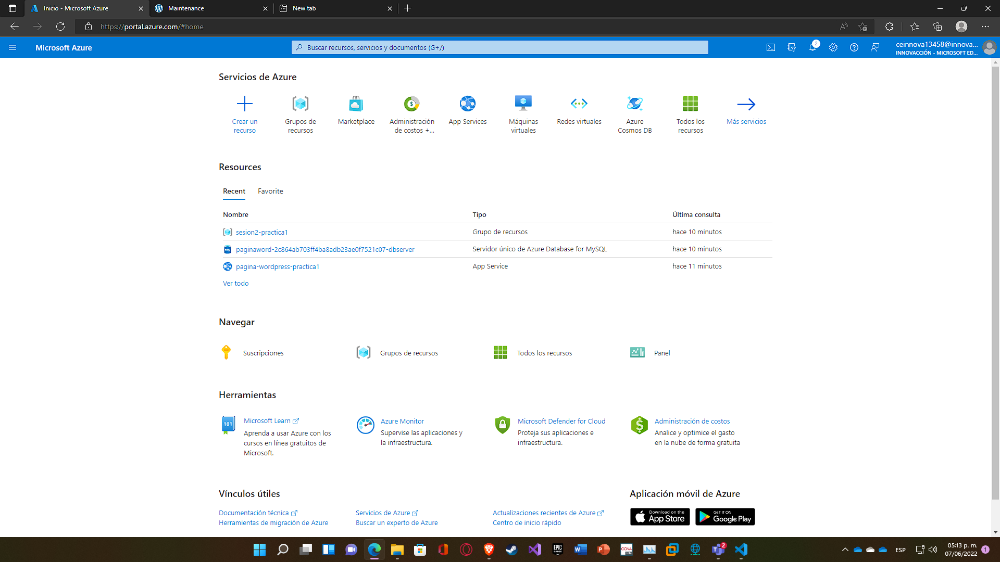

2. En Marketplace buscamos "Wordpress" y lo seleccionamos.
   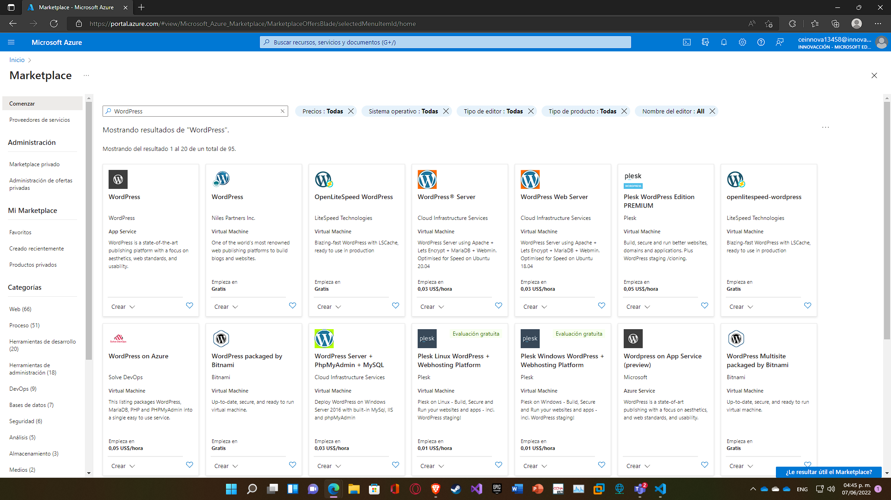

3. Se elige la opción "Crear".
   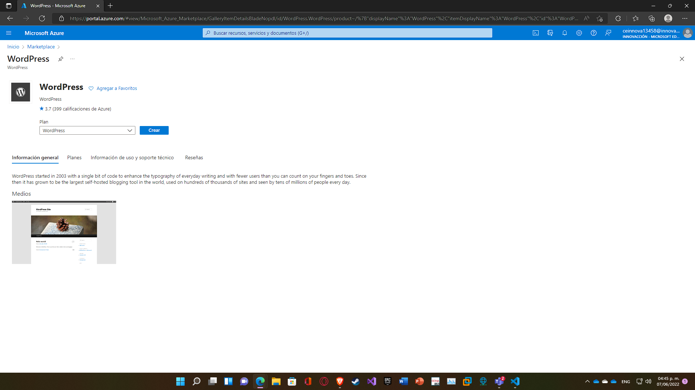

4. Llenamos los campos correspondientes.
   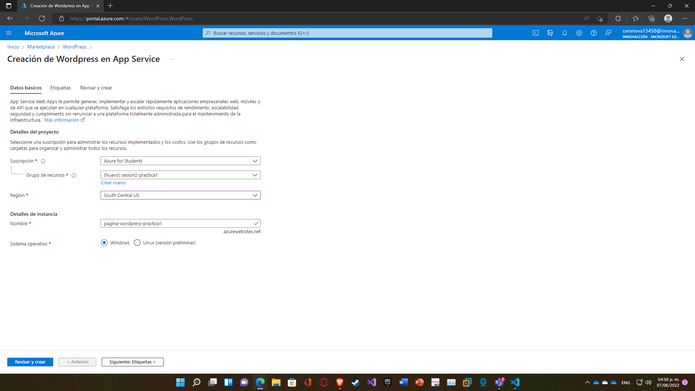

5. De forma opcional agregamos etiquetas. Estas sirven para: - Hacer reportes de costos. - Cumplir normativas de seguridad. - Para dar más información a quien use Azure.
   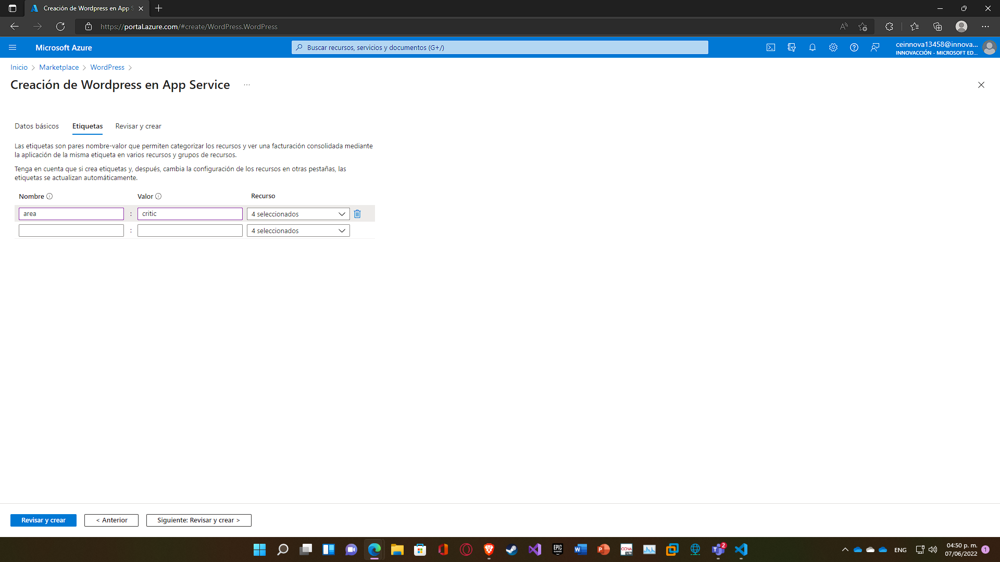

6. Al dar click en "Revisar y Crear" Azure verificará que todo esté correcto y después se podrá hacer click en "Crear".
   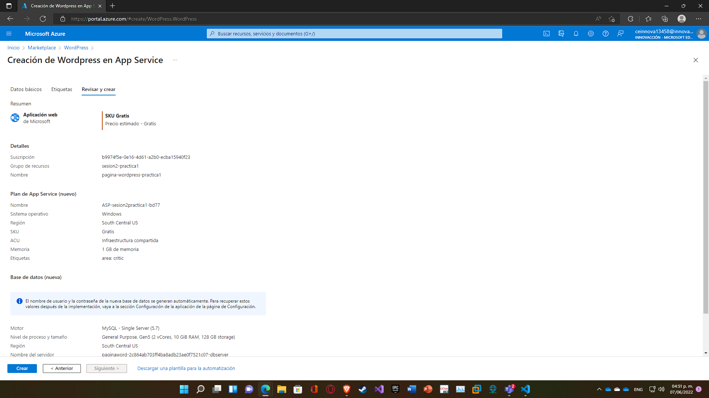

7. Al finalizar el paso anterior, se comenzará la implementación en Azure.
   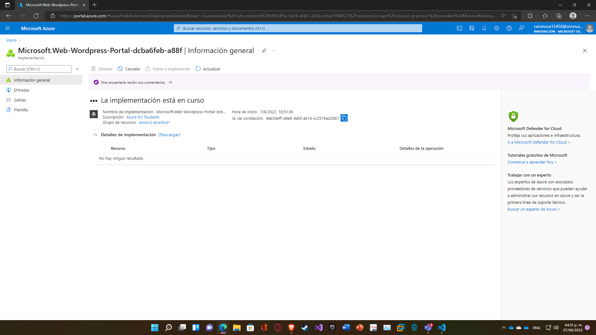

8. Después algunos minutos, la implementación estará lista. Se procede a dar click en "Ir al recurso".
   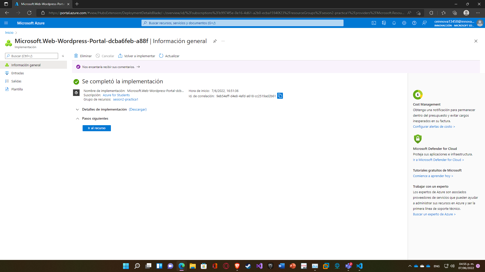

9. Dentro del portal seleccionamos el link al lado derecho de donde dice "URL".
   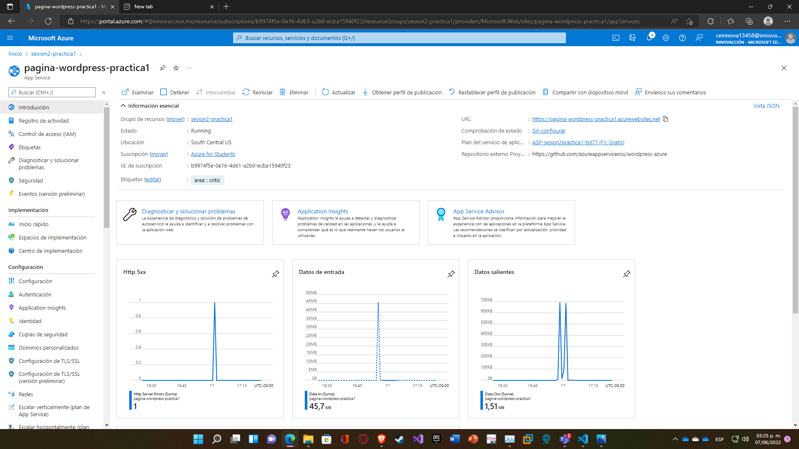

10. Aparecerá un menú en donde debemos seleccionar el país correspondiente.
    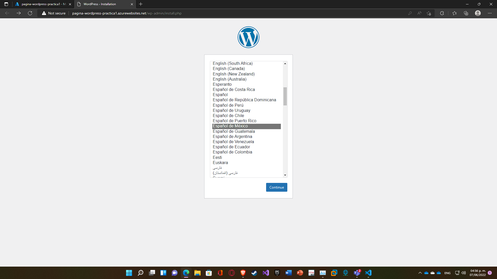

11. Se llenan los campos con la información necesaria y opcionalmente se selecciona o no la casilla del fondo. Posteriormente se da click en "Instalar WordPress".
    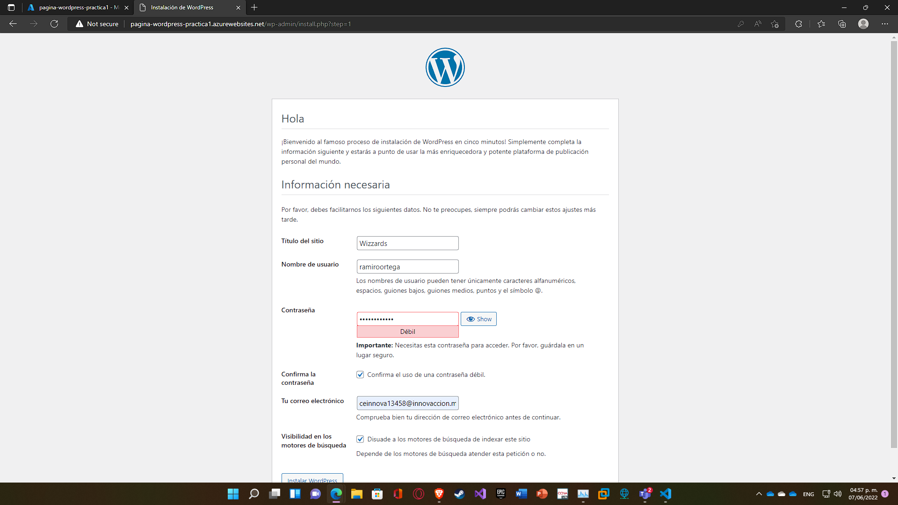

12. Después de un momento aparcerá un mensaje con el texto "¡Lo lgoraste!".
    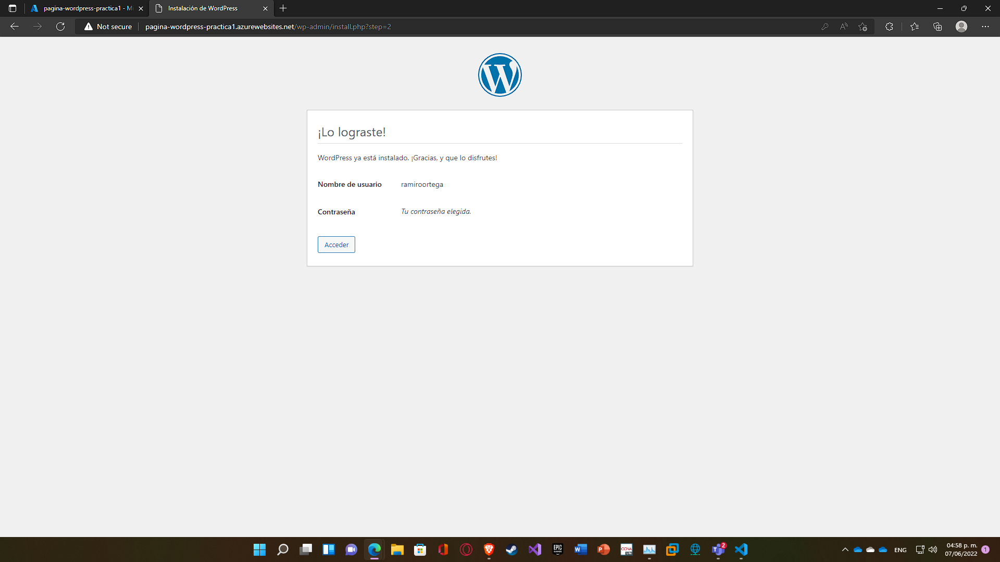

13. Para ver la página web solo se necesita eliminar todo el texto de la URL hasta en donde está ".net". Seguidamente, aparecerá la página con "¡Hola mundo!".
    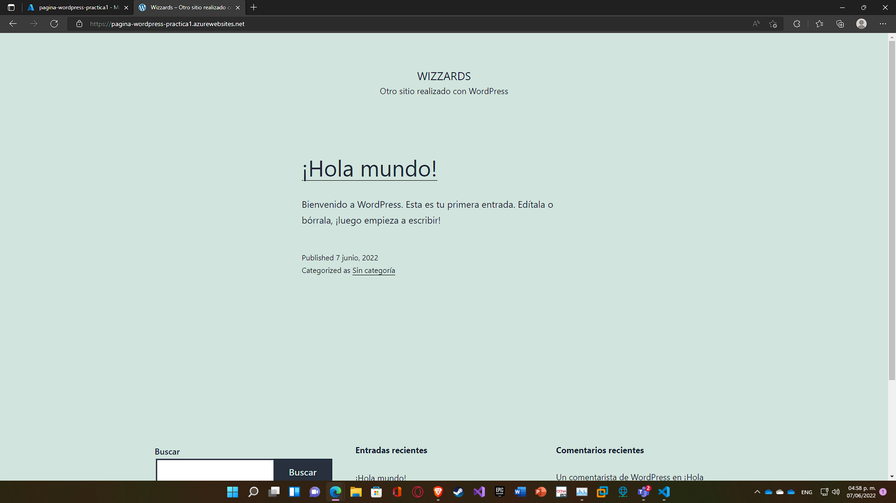

14. Para finalizar, si se desea es posible administrar la página. Para esto solo se debe agregar despues del .net del enlace en la parte de arriba del navegador lo siguiente: "/wp-admin/".
    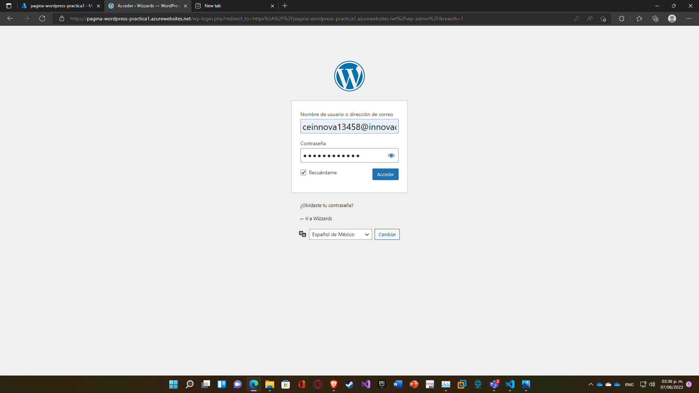

15. Una vez logueados, aparecerá toda una interfaz nueva para la administración.
    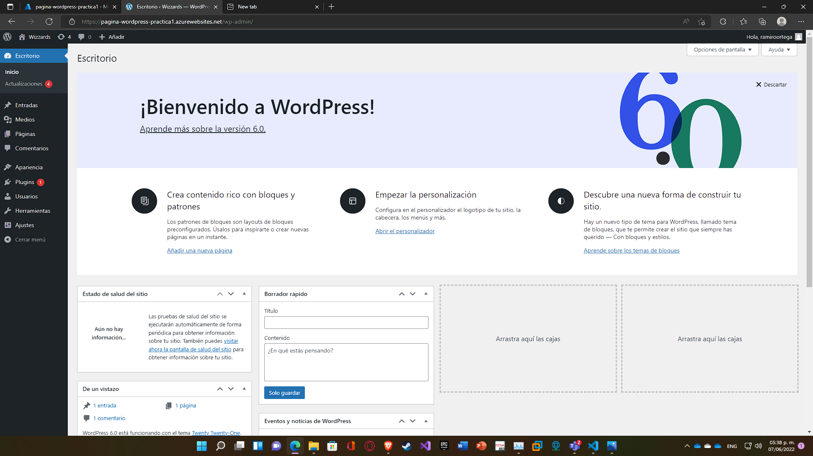
