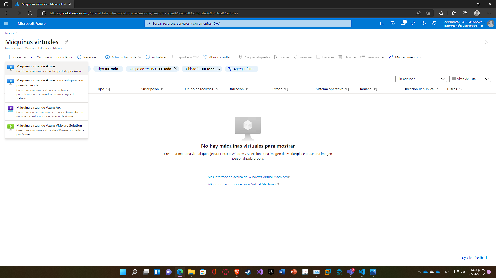

# Practica 02. Maquinas Virtuales.

Creación y ejecución de dos Máquinas Virtuales en Azure.

## Requisitos

- Cuenta de Azure con suscripción activa.
- Sistema Operativo Windows, Linux o MacOs.
- Conexión estable a internet.

## Procedimiento

1. Ingresamos a [Portal Azure](https://portal.azure.com)
   

2. Seleccionamos o buscamos el recurso **"Máquinas Virtuales"** y accedemos.
   

3. Seleccionamos la opción **"Crear"** y seleccionamos **"Máquina virtual de Azure"**.
   

4. En esta parte se hace lo siguiente:
   - Se crea un grupo de recursos.
   - Se elige otra región (en caso de que no existan **"Tamaños"** disponibles).
   - Se elige una **imágen**, en este caso es Windows 10 Pro.
   - Se crea un usuario y contraseña para acceder remotamente a la Máquina Virtual.
   - Se confirma que se posee una licencia válida de Windows 10.

- Cualquier otra configuración dependerá del usuario.
  Al finalizar se da click en **"Revisar y crear"**
  

5. Elegimos la opción **"Crear"** si no hay problemas.
   

6. Al finalizar lo anterior, comenzará a implementarse la Máquina Virtual. Mientras pasa lo ya mencionado, se creará otra Máquina Virtual con las mismas características, todo siguiendo exactamente los mismos pasos (desde paso 1).
   

7. Cuando la implementación de ambas Máquinas Virtuales finalice, aparecerá algo como en la imágen siguiente.
   

8. En VM1 elegimos la opción **"Conectar"** y **"RDP"**.
   

9. Abrimos **Remote Desktop Connection** en nuestro Windows y colocamos la IP Pública que aparece.
   

10. Se ingresa el usuario y la contraseña registrados al momento de configurar la Máquina Virtual, posteriormente se da click en OK.
    

11. Se da click en Yes.
    

12. Después de un momento, la Máquina Virtual habrá cargado completamente y tendremos control sobre ella.
    

13. Antes de proseguir debemos verificar la dirección IP Pública de la Máquina Virtual 2 en **Portal Azure**.
    

14. Ahora dentro de la Máquina Virtual se abrirá **"Remote Desktop Connection"** y se colocará la IP correspondiente a la otra Máquina Virtual. Posteriormente se ingresa el usuario y la contraseña registrados para esa Máquina Virtual.
    

15. Se da click en Yes.
    

16. Después de un momento la Máquina Virtual 2 aparecerá. En este caso se usó el comando **ipconfig** en el CMD para demostrar que contienen dos IPs distintas.
    
