# App Web en PHP

Uso de **App Services** para implementar una página web hecha con PHP.

---

## Requisitos

- Suscripción Azure activa.
- Cuenta de GitHub.
- El repositorio debería poseer un archivo preferentemente **index.php**.

---

## Procedimiento

1. Entramos a [Portal Azure](https://portal.azure.com).
   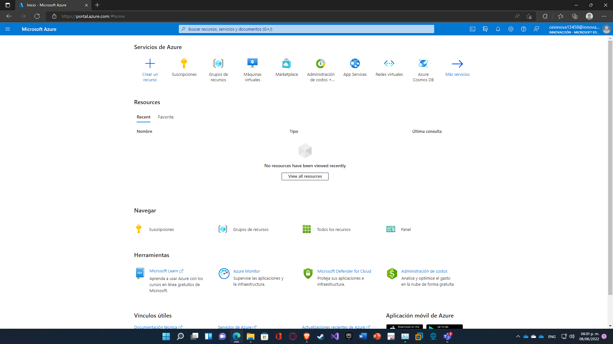

2. En el buscador escribimos **App Services** y le damos click.
   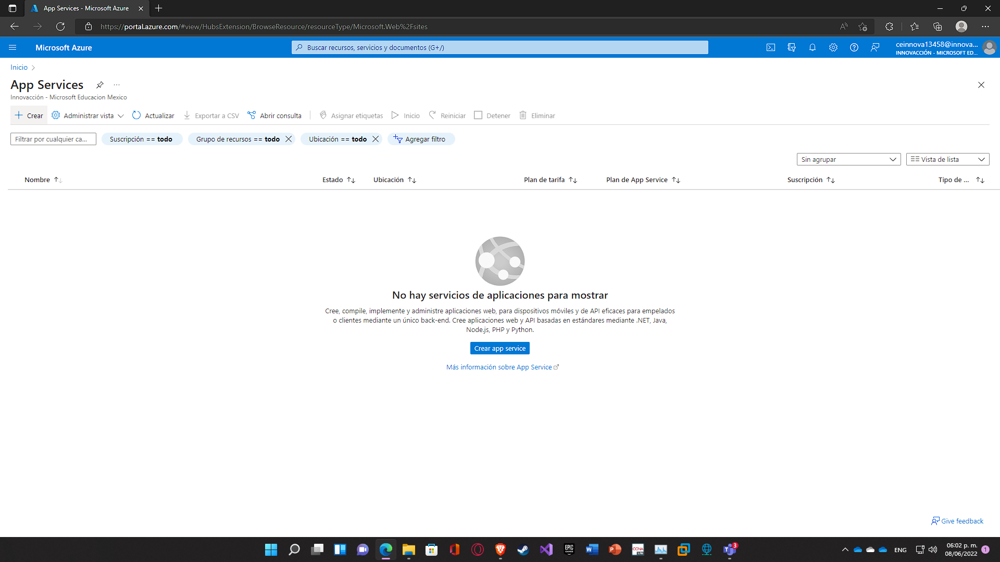

3. Damos click en **Crear**.
   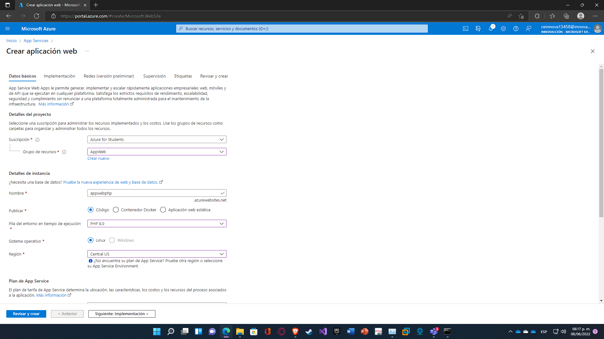

4. Llenamos los campos. Se necesita:
   _ Una suscripcion
   _ Grupo de recursos
   _ Nombre (que será para la URL)
   _ Elegir si queremos subir Código, Contendeor Docker o Aplicación web estática.
   _ Sistema operativo (Linux en este caso).
   _ Región
   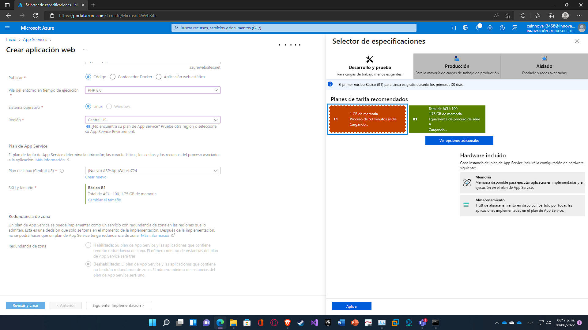

5. Un poco más abajo tenemos **Plan de Linux**, se deja por defecto. Sin embargo, en **Sku y tamaño** damos click en **Cambiar tamaño** y seleccionamos **F1**. Esto evitará cobros.
   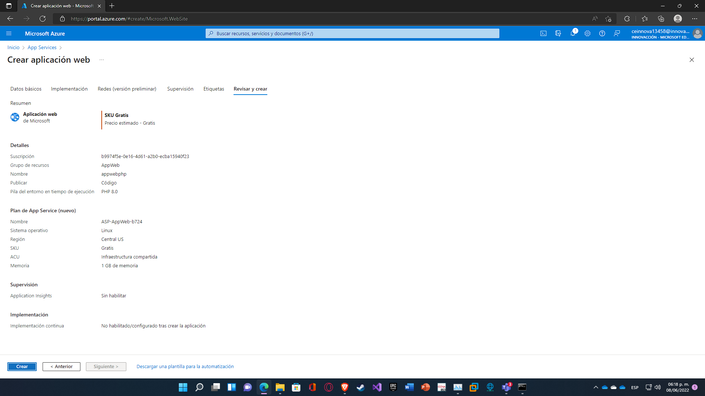

6. No es necesario hacer otra cosa, simplemente nos vamos al apartado de **Revisar y crear** y al final seleccionamos **Crear**.
   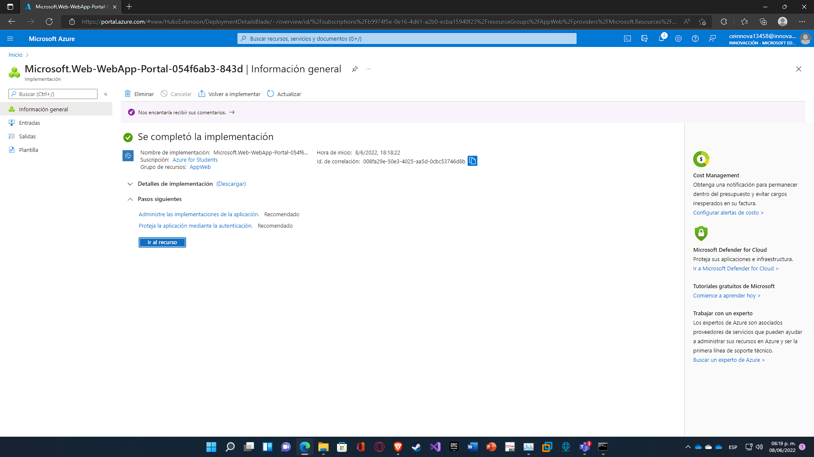

7. La implementación comenzará y tardará unos minutos en terminar. Damos click en **Ir al recurso**.
   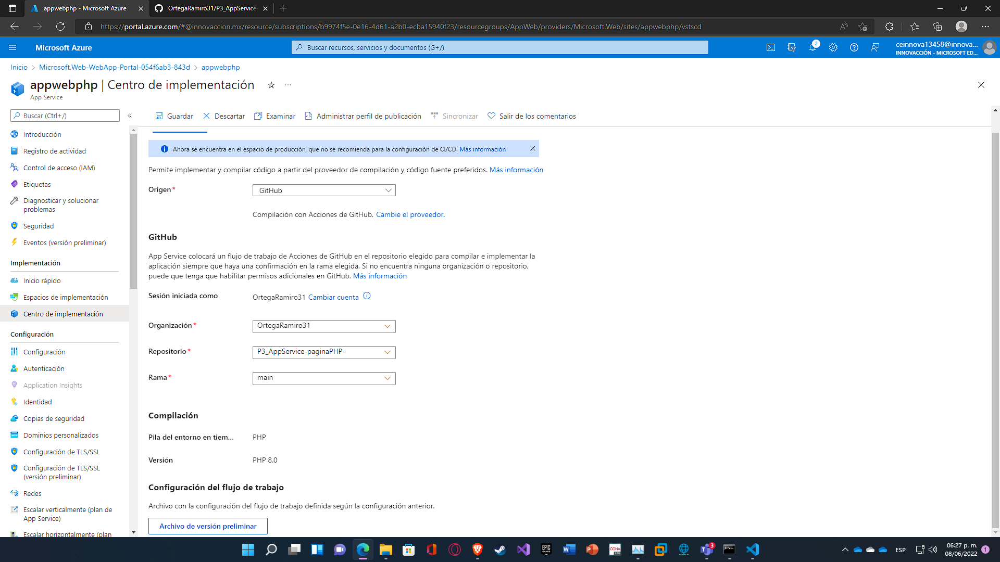

8. Una vez dentro del recurso, seleccionamos **Centro de implementación** y una vez dentro seleccionamos de **Origen** a GitHub.

   - Nos logueamos con nuestra cuenta.
   - En organización seleccionamos nuestra cuenta de usuario.
   - En repositorio seleccionamos el repositorio con la página web.
   - En rama, seleccionamos la correspondiente, en este caso, main.
     Al final solo se da click en **Guardar**.

   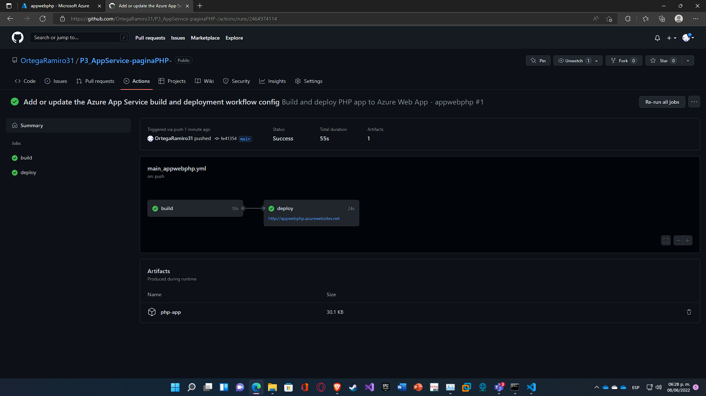

9. En nuestro repositorio de GitHub podemos ver las acciones que está sucediendo. Para observar lo anterior, seleccionamos nuestro repositorio y seleccionamos **Action**. La acción que aparecerá se debe a lo que hicimos anteriormente en Azure. Cuando la página esté lista aparecerá un círculo verde con una palomita.
   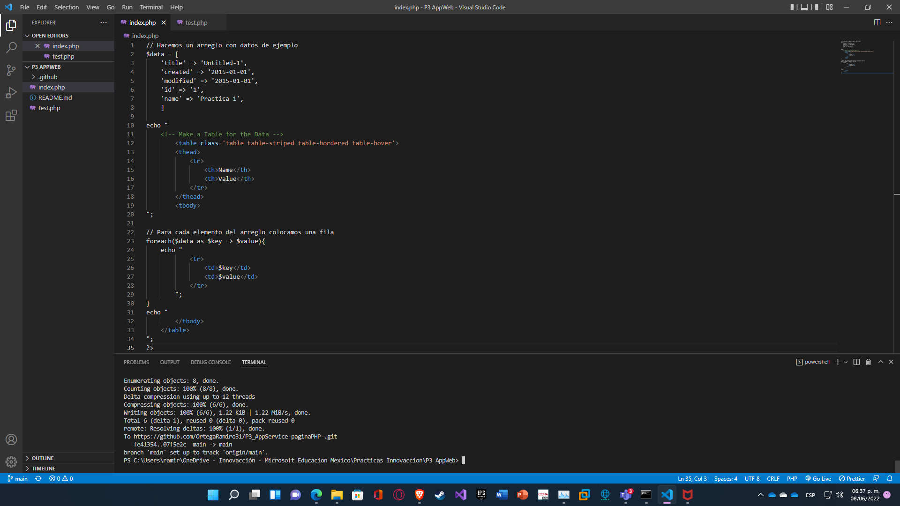

10. Regresando a el recurso creado, en la parte de **Introducción** damos click en el enlace que aparece al lado derecho de **URL**, esto nos redirigirá a nuestra página web.
    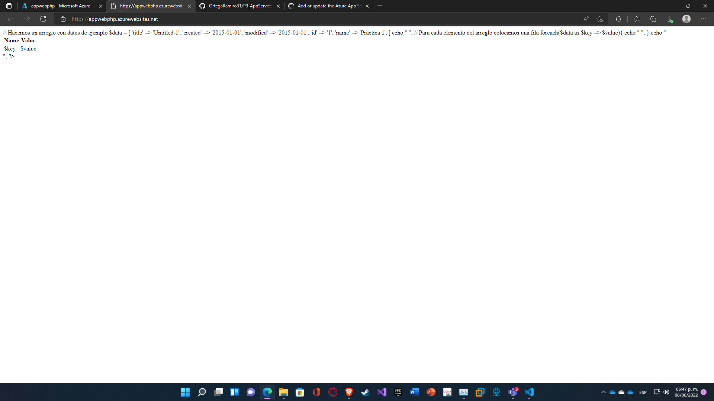

11. En este caso, este es el resultado obtenido cuando entramos a la página web.
    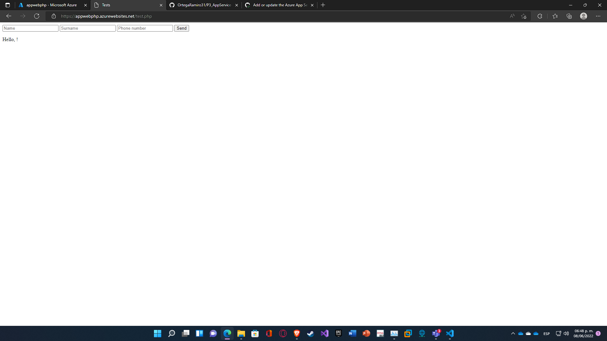

`Si tenemos otro archivo php o html podemos acceder a él simplemente modificando en la barra de direcciones como se muestra en la siguiente imágen. `
