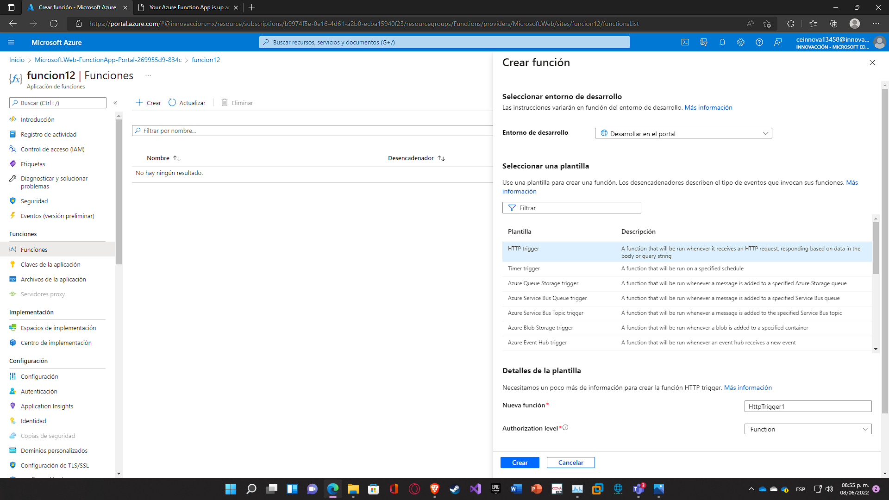

# Azure Functions

Uso básico de Azure Functions.

---

## Requisitos

- Cuenta de Azure activa.

---

## Pasos

1. Entrar a [Portal Azure](https://portal.azure.com).
   

2. En el buscador escribimos **Aplicación de funciones**. Al entrar damos click en el botón de **Crear**.
   

3. Llenamos todos los campos. Necesitamos:

   - Una suscripción.
   - Grupo de recursos.
   - Nombre de la aplicación de funciones.
   - Pila del entorno de ejecución.
   - Versión.
   - Región.
   - Sistema Operativo.
   - Plan.

   Después de todo lo anterior damos click en **"Revisar y Crear"**.
   

4. Damos click en **Crear** y comenzará la implementación.
   

5. Al terminar la implementación damos click en **Ir al recurso**.
   

6. Seleccionamos el apartado de **Funciones**, después damos click en **Crear** y en la nueva ventana elegimos un trigger, en este caso es **HTTP trigger**. Lo demás lo dejamos como está y damos click en **Crear**.
   

7. Después de un momento cargará algo así como una nueva ventana. Damos click en **Código y prueba**. Automaticamente aparecerá un código de Javascript, solo debemos dar click en **Probar/ejecutar** en la parte de arriba.
   

8. Como entrada podemos poner un nombre. En este caso se hizo de esta forma:
   {
   "name": "Ramiro"
   }
   Después damos click en **Ejecutar** y mostrará la salida que aparece en la imágen.
   
