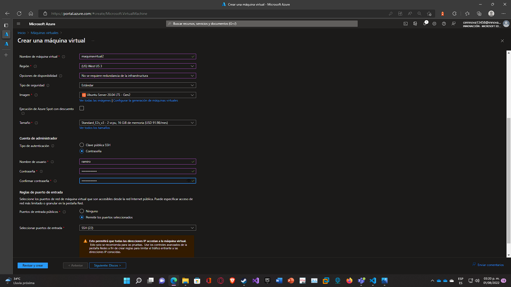
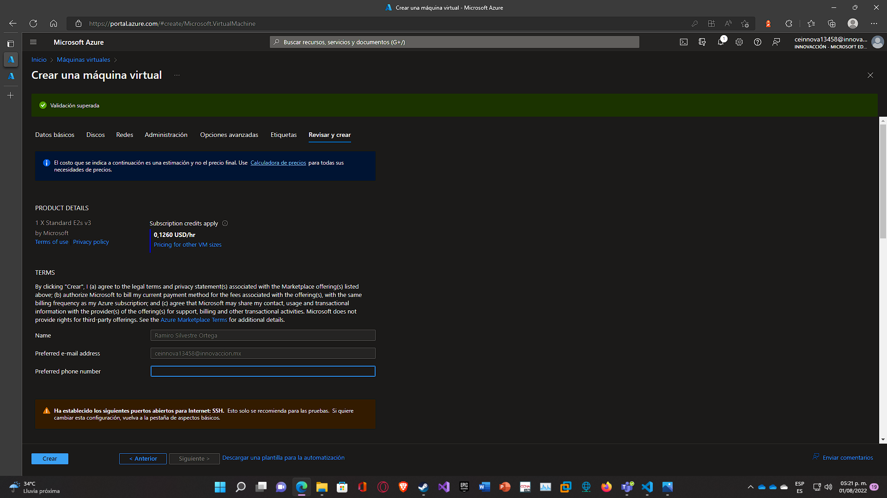

# Azure Functions

Uso básico de Azure Virtual Network.

---

## Requisitos

- Cuenta de Azure activa.

---

## Pasos

1. Entrar a [Portal Azure](https://portal.azure.com).
   

2. Debe crearse un grupo de recursos. En el [Portal Azure](https://portal.azure.com) en la barra de búsqueda escribimos Grupo de Recursos, damos click en **Crear** y después llenamos los campos con la información básica necesaria.
   

3. Al terminar la creación aparecerá el grupo de recursos en los **Grupos de Recursos** del [Portal Azure](https://portal.azure.com).
   

4. Ahora debemos buscar en el buscador del [Portal Azure](https://portal.azure.com) **Redes Virtuales**. Posteriormente, damos click en crear.
   

5. Llenamos los campos, seleccionando el grupo de recursos previamente creado.
   **_NOTA: La región seleccionada deberá de ser la misma para las máquinas virtuales que se crearán después_**.
   

6. Antes de dar click en crear debemos ir al apartado de **Direcciones IP** y una vez dentro seleccionar la Subred con el nombre de _default_ y cambiar el nombre si así se desea. Despúes damos click en _guardar_ y en _Revisar y crear_ para proceder con la implementación.
   

7. Procedemos con la implementación.
   

8. Al terminar la creación de la Virtual Network anterior, procederemos a crear otra siguiendo los mismos pasos anteriores.
   

9. Cambiamos el nombre de la subred, en este caso será **Subred2**.
   

10. Revisión de las configuraciones de la Virtual Network 2.
    

11. Al crear las dos Redes Virtuales podremos verlas dentro de las **Redes Virtuales** del [Portal Azure](https://portal.azure.com).
    

12. Ahora procedemos a crear una máquina virtual. En la barra de búsqueda del [Portal Azure](https://portal.azure.com) escribimos _Maquinas Virtuales_, al entrar damos click en _Crear_ y luego en **Máquina virtual de Azure**. Una vez hagamos lo anterior, llenamos los campos obligatorios con la configuración que se muestra en la imágen. Lo más importante que debe recalcarse es que en el **Tipo de autenticación** debemos seleccionar **Contraseña**.  
    

13. Ahora en el apartado de **Redes** en el campo de **Red virtual** seleccionamos la primera red virtual que creamos. En el apartado de **Subred** buscamos también la subred a la que cambiamos el nombre. Una vez terminado lo anterior ya podemos dar click en **Revisar y crear**. **Si no aparece la red virtual es probable que se encuentre en una región diferente a la que tiene la máquina virtual**.  
    

14. Ahora en el apartado de **Redes** en el campo de **Red virtual** seleccionamos la primera red virtual que creamos. En el apartado de **Subred** buscamos también la subred a la que cambiamos el nombre. Una vez terminado lo anterior ya podemos dar click en **Revisar y crear** y despúes en **Crear**. **Si no aparece la red virtual es probable que se encuentre en una región diferente a la que tiene la máquina virtual**.  
    

15. Al terminar la implementación de la máquina virtual procederemos otra muy parecida.  
    

16. En el apartado de Redes eligiremos la red virtual dos con la Subred que modificamos o creamos.  
    

17. En el apartado de Redes eligiremos la red virtual dos con la Subred que modificamos o creamos. Al finalizar lo anterior, damos en **Revisar y crear** y después en **Crear**. Con esto ya tendremos listas las dos Máquinas Virtuales.
    

18. Ahora entramos a las configuraciones de la máquina virtual 1 en el [Portal Azure](https://portal.azure.com), nos vamos a **Conectar** y ahí copiamos el acceso para la máquina virtual. En ete caso está marcado de color azúl y es ramiro@20.25.153.38.
    

19. Ahora abrimos la Cloud Shell. Si no tenemos almacenamiento simplemente damos click en **Crear almacenamiento**.
    

20. Al crearse el almacenamiento usamos el comando **ssh "acceso"**, en donde "acceso" hace referencia al dato de acceso del paso 18.
    

21. Cuando demos Enter, nos pedirá la contraseña de la máquina virtual y luego aparecerá un mensaje en el que diremos que _yes_. Con esto ya estaremos dentro de la máquina virtual.
    

22. Ahora, ambas máquinas virtuales están en diferentes Redes Virtuales, por lo tanto, no es posible que tengan comunicación de momento. Para resolver lo anterior, debemos ir a la Red virtual 1 y luego buscar **Emparejamiento**.
    

23. En el apartado de **Esta red virtual** en **Nombre del vínculo de emparejamiento** es preferible colocar el nombre de la red virtual 1 separando con un guión el nombre de la red virtual 2, esto para recordar que estamos haciendo una conexión de la red virtual 1 a la 2.
    En el apartado de **Red virtual remota** colocamos lo mismo, solo que preferentemente ahora primero será el nombre de la red virtual 2 separando por un guion el nombre de la red virtual 1.
    Por último en **Red virtual** seleccionamos la red virtual 2 que habíamos creado porque es la que es remota. Damos click en **Guardar**.
    

24. Al guardar, el emparejamiento estará listo. Solo será necesario esperar a que cambie el **Estado del emparejamiento** de **actualizando** a **conectado**.
    

25. Después de un momento podrá notarse que el **Estado del emparejamiento** ahora está como **conectado**.
    

26. Ahora para probar que si están conectadas las dos redes virtuales hacemos un ping de la máquina virtual 1 a la máquina virtual dos. En la imágen fue exitoso, por lo tanto, las dos redes virtuales están correctamente emparejadas.
    
